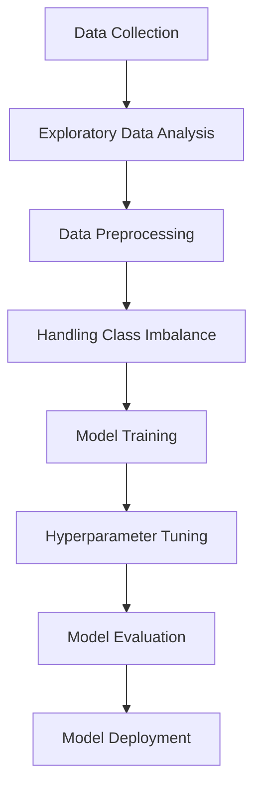

# Diabetes Prediction System

## Overview
This project implements a comprehensive machine learning system for diabetes prediction using a dataset of medical records. The system explores various classification algorithms and handles class imbalance using advanced techniques to build an accurate predictive model. The Jupyter notebook includes complete data analysis, visualization, preprocessing, model training, and evaluation workflows.

## Dataset
Link to Dataset: https://www.kaggle.com/datasets/iammustafatz/diabetes-prediction-dataset/data

The dataset (`diabetes_prediction_dataset.csv`) contains 100,000 medical records with the following features:
- `gender`: Patient's gender (Male, Female, Other)
- `age`: Patient's age
- `hypertension`: Presence of hypertension (0 or 1)
- `heart_disease`: Presence of heart disease (0 or 1)
- `smoking_history`: Patient's smoking history (never, former, current, etc.)
- `bmi`: Body Mass Index
- `HbA1c_level`: Glycated hemoglobin level
- `blood_glucose_level`: Blood glucose level
- `diabetes`: Diabetes diagnosis (0 = No, 1 = Yes)

## Key Features
- **Data Visualization**: Comprehensive EDA with visualizations of:
  - Gender distribution
  - Diabetes prevalence by gender
  - Class imbalance analysis
- **Advanced Preprocessing**:
  - Handling class imbalance with SMOTE and ADASYN
  - Feature scaling and encoding
- **Machine Learning Models**:
  - Random Forest
  - Gradient Boosting
  - XGBoost
  - Logistic Regression
  - SVM
  - Naive Bayes
  - Balanced ensemble methods
- **Hyperparameter Tuning**: Optimized using Optuna
- **Model Evaluation**:
  - Accuracy, Precision, Recall, F1-Score
  - Classification reports
  - Cross-validation

The notebook is structured as follows:
- Data loading and exploration
- Data visualization
- Data preprocessing
- Model training and evaluation
- Hyperparameter tuning
- Model saving with Joblib

## Key Results
- Achieved **97.1% accuracy**
- Best performing model: **XGBoost Classifier**
- Key insights from EDA:
  - Diabetes prevalence: 8.5%
  - Strong correlation between HbA1c levels and diabetes
  - Gender-based differences in diabetes prevalence

## Methodology

